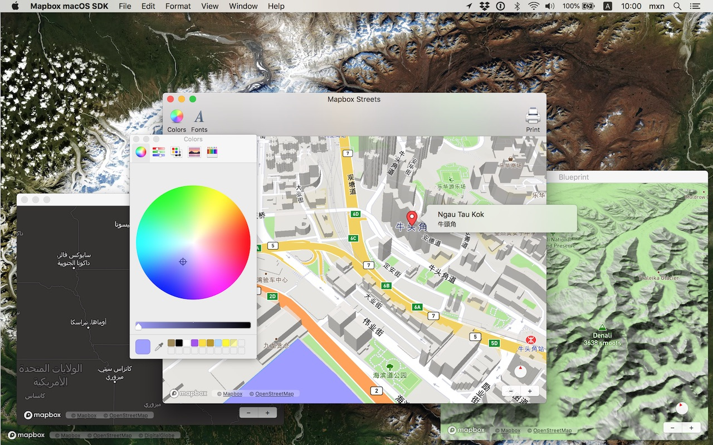

# [Mapbox Maps SDK for macOS](https://mapbox.github.io/mapbox-gl-native/macos/)

Put interactive, scalable world maps into your native Cocoa application with the Mapbox Maps SDK for macOS.

* Mapbox-curated [map styles](https://www.mapbox.com/maps/) and [OpenStreetMap-based](https://www.mapbox.com/vector-tiles/mapbox-streets-v7/) [vector tiles](https://www.mapbox.com/vector-tiles/) make it easy to get started.
* Customize every aspect of the map’s appearance in code or visually using [Mapbox Studio](https://www.mapbox.com/mapbox-studio/).
* High-performance OpenGL rendering and multitouch gestures keep your users happy.
* A well-designed, fully documented API helps you stay productive.
* Develop across [multiple platforms](../../README.md), including [iOS](../ios/README.md), using the same styles and similar APIs.

The Mapbox Maps SDK for macOS is compatible with macOS 10.10.0 and above for Cocoa applications developed in Objective-C, Swift, Interface Builder, or AppleScript. For hybrid applications, consider [Trackasia GL JS](https://github.com/mapbox/mapbox-gl-js/).

Information for Mac developers:

* [Integrate the Mapbox Maps SDK for macOS into your application](https://mapbox.github.io/mapbox-gl-native/macos/)
* [Learn how to use the Mapbox Maps SDK for macOS](https://mapbox.github.io/mapbox-gl-native/macos/)
* [Browse example styles designed in Mapbox Studio](https://www.mapbox.com/gallery/)

Information for contributors:

* [Build the Mapbox Maps SDK for macOS from source](INSTALL.md)
* [Contribute to the Mapbox Maps SDK for macOS](DEVELOPING.md)
* [Mapbox Style Specification](https://www.mapbox.com/mapbox-gl-style-spec/)
* [Mapbox Vector Tile Specification](https://www.mapbox.com/developers/vector-tiles/)

Mapbox does not officially support the macOS SDK to the same extent as the iOS SDK; however, bug reports and pull requests are certainly welcome.
